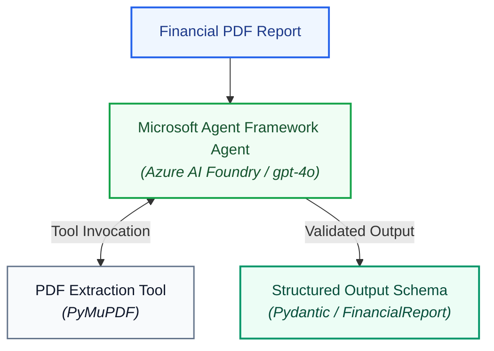

# Financial Extractor Agent (`fin-extractor-agent`)

AI Agent powered by **Microsoft Agent Framework (MAF)** and **Azure AI Foundry** to extract structured financial metrics from PDF documents into validated JSON schemas.

---

## Architecture Overview



1. **PDF Extractor Tool:** An agent-callable tool that parses financial PDFs, extracting high-fidelity text, metadata, and structured tables.
2. **Microsoft Agent Framework Core:** Uses Azure AI Foundry (`agent_framework_foundry.FoundryChatClient`) and `DefaultAzureCredential` to orchestrate multi-step reasoning over financial statements, balance sheets, cash flows, and income statements.
3. **Structured Output Model:** Strictly enforces data types and schemas using Pydantic models ([`FinancialReport`](src/fin_extractor/models/schemas.py)).

> **Deep Dive:** For the complete technical architecture, Mermaid sequence diagrams, Azure AI Foundry provisioning steps, and MAF code implementation, see [**`docs/ARCHITECTURE.md`**](docs/ARCHITECTURE.md).

---

## Project Structure

```
fin-extractor-agent/
├── .env.example              # Template for Azure AI Foundry credentials
├── .gitignore                # Git ignore rules
├── pyproject.toml            # Project metadata and package definition
├── requirements.txt          # Python dependencies
├── README.md                 # Project documentation
├── docs/
│   └── ARCHITECTURE.md       # Detailed technical architecture & MAF/Foundry guide
├── data/
│   ├── postman_collection.json # Pre-configured Postman collection for API testing
│   └── samples/              # Sample financial PDFs for testing and demos
├── src/
│   └── fin_extractor/
│       ├── __init__.py
│       ├── main.py           # Application entrypoint & Uvicorn launcher
│       ├── config.py         # AppSettings for Azure AI Foundry & App Insights
│       ├── agents/           # Microsoft Agent Framework agent definitions
│       ├── api/              # FastAPI application and REST endpoints
│       ├── models/           # Pydantic structured output models & schemas
│       ├── prompts/          # Domain-tailored system prompts and instructions
│       ├── security/         # Input safety guardrails & Prompt Shield screening
│       ├── skills/           # MAF Agent Skills (financial-auditor, currency-normalizer)
│       ├── tools/            # PDF parsing & extraction tools (PyMuPDF)
│       └── utils/            # Logging, OpenTelemetry tracing, and utilities
└── tests/
    ├── __init__.py
    ├── conftest.py           # Pytest fixtures & telemetry isolation
    ├── test_agent.py         # Agent orchestrator unit tests
    ├── test_api.py           # FastAPI endpoint unit tests
    ├── test_config.py        # Configuration unit tests
    ├── test_models.py        # Pydantic schema validation tests
    ├── test_pdf_extractor.py # PDF parsing tool unit tests
    ├── test_prompt_shield.py # Prompt Shield guardrail unit tests
    ├── test_skills.py        # Agent skills discovery & execution unit tests
    └── test_telemetry.py     # OpenTelemetry and tracing unit tests
```

---

## Quickstart

### 1. Environment Setup
```bash
# Create virtual environment with Python 3.11+
python3.11 -m venv .venv
source .venv/bin/activate

# Install dependencies and local package in editable mode
pip install -r requirements.txt
pip install -e .
```

### 2. Configure Credentials
Copy `.env.example` to `.env`:
```bash
cp .env.example .env
```

Configure your Azure AI Foundry project and Application Insights:
```env
FOUNDRY_PROJECT_ENDPOINT=https://<your-hub-resource>.services.ai.azure.com/api/projects/<your-project-name>
FOUNDRY_MODEL=gpt-4o
LOG_LEVEL=INFO

# Observability & Tracing Controls:
ENABLE_GENAI_TRACING=true
CAPTURE_MESSAGE_CONTENT=true

# Guardrails & Content Safety (Prompt Shields):
ENABLE_PROMPT_SHIELD=true
# CONTENT_SAFETY_ENDPOINT=https://<your-hub-resource>.cognitiveservices.azure.com

# Agent Skills (Progressive Disclosure):
ENABLE_SKILLS=true
# SKILLS_DIR=src/fin_extractor/skills

# Optional override: Auto-discovered from FOUNDRY_PROJECT_ENDPOINT if omitted
# APPLICATIONINSIGHTS_CONNECTION_STRING=InstrumentationKey=...;IngestionEndpoint=...
```

Authenticate via Azure CLI:
```bash
az login
```

---

## Running the API & Testing

### 1. Start the FastAPI Server
```bash
# Run using the python entrypoint:
python -m fin_extractor.main

# Or run using uvicorn directly:
uvicorn fin_extractor.api:app --reload --port 8000
```
The server will start at: `http://localhost:8000`

### 2. API Endpoints

| Method | Endpoint | Description |
|---|---|---|
| `GET` | `/health` | Service health status and Azure AI Foundry configuration state |
| `POST` | `/api/v1/extract` | Upload a financial PDF and extract structured `FinancialReport` JSON |

### 3. Interactive Swagger UI (Browser)
Visit **`http://localhost:8000/docs`** in your browser to:
- Test the `GET /health` endpoint.
- Test `POST /api/v1/extract` by dragging and dropping `data/samples/TechNova Q3 2026 Financial Results.pdf`.

### 4. Testing with Postman
Import the pre-configured collection:
1. Open **Postman**.
2. Click **Import** and select `data/postman_collection.json`.
3. Open the request: **Extract Financial Metrics** (`POST http://localhost:8000/api/v1/extract`).
4. In the **Body** tab (`form-data`), click the `file` field and choose your PDF (`data/samples/TechNova Q3 2026 Financial Results.pdf`).
5. Click **Send** to see the extracted structured JSON!

### 5. Testing with cURL
```bash
curl -X POST "http://localhost:8000/api/v1/extract" \
  -H "accept: application/json" \
  -H "Content-Type: multipart/form-data" \
  -F "file=@data/samples/TechNova Q3 2026 Financial Results.pdf"
```

---

## Observability & Foundry Tracing

All API requests, agent workflows, tool calls, and LLM completions are instrumented via **OpenTelemetry** and streamed directly to **Azure AI Foundry Tracing**:

1. Open your Foundry project: **`<your-project-name>`**.
2. In the left sidebar, navigate to **Observe and optimize** $\rightarrow$ **Tracing**.
3. View the live waterfall traces:
   - Root HTTP span: `POST /api/v1/extract`
   - Agent orchestrator: `agent_extract_financial_data`
   - Tool execution: `extract_pdf_pages` (page numbers, character count)
   - Azure OpenAI call: `chat.completions` (model latency, prompt & completion tokens, full input/output payload)

### Tracing Configuration Options

| Variable | Default | Description |
|---|---|---|
| `ENABLE_GENAI_TRACING` | `true` | Toggle OpenTelemetry distributed tracing on/off |
| `CAPTURE_MESSAGE_CONTENT` | `true` | When `true`, logs full prompt text and model output. Set `false` to redact content for production privacy/PII |
| `APPLICATIONINSIGHTS_CONNECTION_STRING` | *Auto-discovered* | Optional override for target Application Insights resource |

---

## Input Safety & Prompt Shield Guardrails

To defend against **indirect prompt injection** attacks embedded inside uploaded corporate PDFs (e.g. malicious instruction overrides hidden in footnotes or white-font text), the service implements **Defense-in-Depth** guardrails via **Azure AI Content Safety**:

1. **Pre-Model Screening:** Extracted PDF text is evaluated using the Prompt Shield API before passing to `gpt-4o`.
2. **Attack Attribution:** If an attack is detected, execution aborts immediately with the offending page number, protecting your system prompt and avoiding model inference costs.
3. **Guardrail Tracing:** Every scan creates a `guardrail_prompt_shield` span in the Azure AI Foundry Tracing waterfall.

### Safety Configuration Options

| Variable | Default | Description |
|---|---|---|
| `ENABLE_PROMPT_SHIELD` | `true` | Toggle indirect prompt injection detection on/off |
| `CONTENT_SAFETY_ENDPOINT` | *Auto-derived* | Azure AI Content Safety / Cognitive Services endpoint (auto-derived from `FOUNDRY_PROJECT_ENDPOINT` if omitted) |
| `CONTENT_SAFETY_API_VERSION` | `2024-09-01` | Azure AI Content Safety API version for `shieldPrompt` |

### Security Violation Error Format (HTTP 422)

```json
{
  "detail": {
    "error": "SecurityViolation",
    "attack_type": "indirect_document_injection",
    "page": 2,
    "message": "Potential prompt injection attack detected on page 2 of the uploaded document."
  }
}
```

---

## Agent Skills (Progressive-Disclosure Skills)

The service incorporates the open **Agent Skills specification** via Microsoft Agent Framework (`SkillsProvider`). Rather than burdening the system prompt with exhaustive GAAP/IFRS instructions and arithmetic, skills follow progressive disclosure:

1. **`financial-auditor`**: Automatically invoked to audit extracted balance sheet figures for equation parity ($\text{Assets} = \text{Liabilities} + \text{Equity}$), calculate net profit margins, verify cash liquidity ratios, and detect unit scaling inconsistencies.
2. **`currency-normalizer`**: Selectively invoked when a document is denominated in non-USD currencies (e.g. EUR, GBP, JPY, CAD) to normalize values to benchmark USD.
3. **Deterministic Script Execution**: Mathematical calculations and parity checks are executed by local Python scripts via `run_skill_script`, guaranteeing zero floating-point hallucination.

### Skills Configuration Options

| Variable | Default | Description |
|---|---|---|
| `ENABLE_SKILLS` | `true` | Toggle Microsoft Agent Framework skills integration |
| `SKILLS_DIR` | `src/fin_extractor/skills` | Directory containing file-based skills |

---

## Running Unit Tests

Run the complete test suite (44 tests) using `pytest`:

```bash
pytest
```

For verbose output with test names:
```bash
pytest -v
```