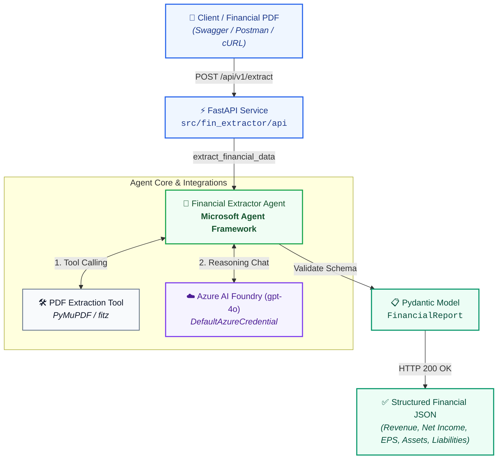
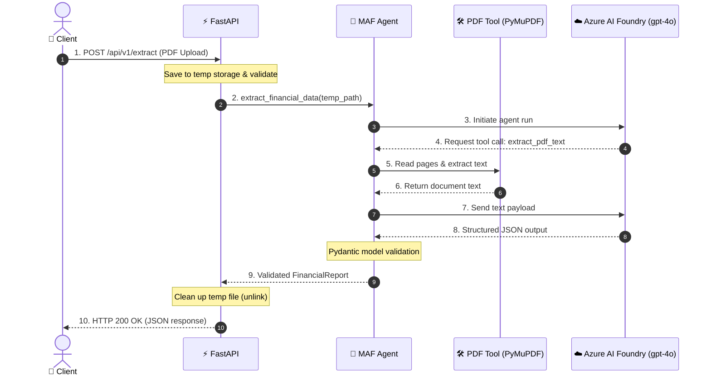
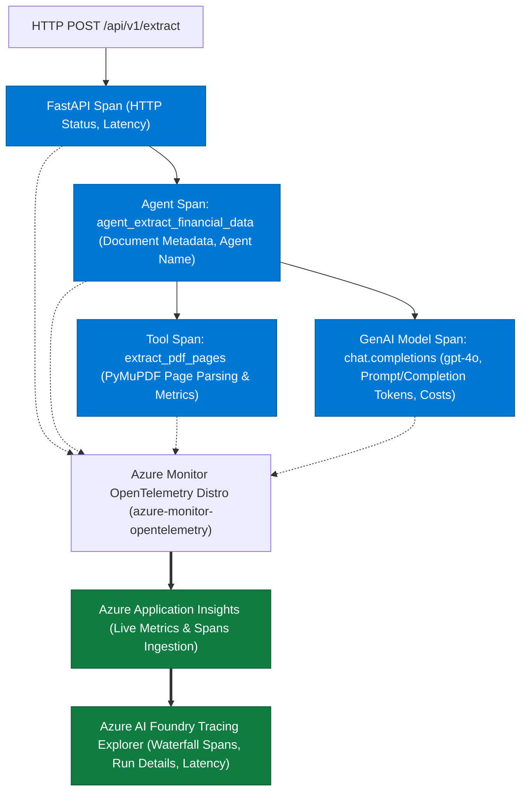

# Financial Extractor Agent: Complete Technical Architecture

This document provides a comprehensive, end-to-end technical overview of the **Financial Extractor Agent (`fin-extractor-agent`)**. It details the system architecture, component responsibilities, data flow, security model, and design decisions.

---

## 1. Executive Summary & Objective

The **Financial Extractor Agent** is an enterprise AI service built on **Microsoft Agent Framework (MAF)** and **Azure AI Foundry**. Its core mission is:

> **Ingest unstructured corporate financial PDF documents (such as 10-K, 10-Q filings, and quarterly earnings releases) and autonomously extract standardized, validated financial metrics into a strongly-typed Pydantic schema without hallucinations.**

### Key Requirements
* **Zero Hallucination Tolerance:** Strict adherence to reported numbers; missing metrics must be mapped to `null` rather than estimated.
* **Accounting Idiom Understanding:** Correct interpretation of negative financial figures formatted in accounting parentheses `(1,234)`, scale multipliers ("in thousands", "in millions"), and fiscal period markers.
* **Enterprise Security:** Passwordless authentication using Azure Active Directory via `DefaultAzureCredential`.
* **Stateless & Ephemeral Storage:** Uploaded files are processed in temporary storage and cleaned up immediately after inference.

---

## 2. System Architecture & Component Diagram



---

## 3. End-to-End Request Lifecycle



---

## 4. Deep Dive into System Components

### 4.1. Presentation & API Layer (`src/fin_extractor/api/app.py` & `main.py`)
* **Framework:** FastAPI with Uvicorn ASGI server.
* **Parameter Binding:** Utilizes modern `typing.Annotated[UploadFile, File(...)]` to avoid default argument function calls, conforming strictly to Ruff rule `B008`.
* **Guardrails & Validations:**
  - Enforces `.pdf` extension check.
  - Checks for 0-byte uploads, rejecting invalid files before agent invocation.
  - Uses `try ... finally` semantics to guarantee that temporary files on disk are unlinked even if extraction errors occur.
* **Endpoints:**
  - `GET /health`: Inspects Azure configuration readiness without initiating billable model calls.
  - `POST /api/v1/extract`: Accepts file upload and triggers extraction.

### 4.2. Agent Orchestration Layer (`src/fin_extractor/agents/extractor_agent.py`)
* **Framework:** **Microsoft Agent Framework (`agent-framework` & `agent-framework-foundry`)**.
* **Client Binding:** `FoundryChatClient` connects directly to the Azure AI Foundry Project Endpoint (`FOUNDRY_PROJECT_ENDPOINT`) using `DefaultAzureCredential`.
* **Agent Configuration:**
  - **Tool Binding:** Supplies `extract_pdf_tool` as an agent-callable tool.
  - **Deterministic Generation:** Configures `temperature: 0.0` to eliminate creative variance and maximize numerical precision.
  - **Schema Enforcement:** Sets `response_format: FinancialReport` to invoke structured output decoding.
* **Validation Fallback:**
  1. Checks `response.value` (automatically deserialized by MAF).
  2. Falls back to `FinancialReport.model_validate(dict)`.
  3. Secondary fallback to `FinancialReport.model_validate_json(response.text)`.

### 4.3. Prompt Engineering & Directives (`src/fin_extractor/prompts/financial_prompts.py`)
System instructions define the agent's internal operational loop:
1. **Target Identification:** Instructs the model to locate the Consolidated Statements of Operations/Income Statement and Consolidated Balance Sheets.
2. **Entity & Period Normalization:** Standardizes reporting entity legal name, period (e.g. `Q3 2026`), and currency code (`USD`, `EUR`).
3. **Multiplier Preservation:** Explicit rule checking for "in thousands", "in millions", or "in billions" headers.
4. **Anti-Hallucination Policy:** Explicit directive that if a metric is absent from the report, the agent must output `null` rather than inferring or calculating unstated numbers.

### 4.4. Tooling & Parsing Layer (`src/fin_extractor/tools/pdf_extractor.py`)
* **Engine:** PyMuPDF (`pymupdf` / `fitz`).
* **MAF Annotation:** Decorated with `@tool(name="extract_pdf_text")`.
* **Execution Strategy:**
  - Validates document existence and non-zero page count.
  - Accepts an optional list of target pages or defaults to extracting all pages.
  - Formats output with Markdown headers: `# Document: <filename>`, page totals, and page separation markers (`--- PAGE X ---`), giving the LLM spatial context of where statements reside.

### 4.5. Data Contract Layer (`src/fin_extractor/models/schemas.py`)
The data contract is formalized through Pydantic v2:
```python
class FinancialReport(BaseModel):
    company_name: str
    reporting_period: str
    currency: str = "USD"
    total_revenue: float | None = None
    net_income: float | None = None
    diluted_eps: float | None = None
    total_assets: float | None = None
    total_liabilities: float | None = None
    cash_and_equivalents: float | None = None
    summary: str | None = None
```
Every field is decorated with semantic descriptions that act as secondary prompting cues to the LLM during structured output generation.

### 4.6. Configuration Layer (`src/fin_extractor/config.py`)
* Built with `pydantic-settings` to parse environment variables or `.env` files.
* Configuration properties:
  - `FOUNDRY_PROJECT_ENDPOINT`: Azure AI Foundry project URI.
  - `FOUNDRY_MODEL`: Target model deployment name (default: `gpt-4o`).
  - `LOG_LEVEL`: Logging verbosity (`INFO`, `DEBUG`).
* Property `is_foundry_configured` provides a lightweight boolean check.

---

## 5. Azure AI Foundry Setup & MAF Implementation Guide

This section explains how the Azure AI Foundry cloud environment was provisioned, how the `gpt-4o` model was deployed, and how the **Microsoft Agent Framework (MAF)** integrates with both.

### 5.1. Provisioning Azure AI Foundry Cloud Resources

1. **Create an Azure AI Hub & Project**:
   - In the [Azure AI Foundry Portal](https://ai.azure.com), create a new **Hub** (or Azure AI Services resource):
     - **Resource Name:** `<your-hub-resource-name>` (e.g. `fin-extractor-hub`)
     - **Region:** Choose a supported region with `gpt-4o` availability (e.g. `East US 2`, `Sweden Central`)
   - Create a child **Project** within the Hub:
     - **Project Name:** `<your-project-name>` (e.g. `fin-extractor-project`)

2. **Deploy the Foundation Model (`gpt-4o`)**:
   - Inside your project, navigate to **Models + endpoints** -> **Deploy model** -> **Deploy base model**.
   - Select **`gpt-4o`** with Standard deployment.
   - Set the **Deployment Name** to `gpt-4o`.

3. **Obtain the Project Connection Endpoint**:
   - In Project Settings -> **Overview**, copy the **Project Endpoint**:
     ```text
     https://<your-hub-resource-name>.services.ai.azure.com/api/projects/<your-project-name>
     ```
   - Configure this in your local `.env` file:
     ```env
     FOUNDRY_PROJECT_ENDPOINT=https://<your-hub-resource-name>.services.ai.azure.com/api/projects/<your-project-name>
     FOUNDRY_MODEL=gpt-4o
     LOG_LEVEL=INFO
     ```

4. **Assign Role-Based Access Control (RBAC)**:
   - Your Azure account (or Managed Identity in production) must have the following role on the AI Services resource:
     - **Cognitive Services OpenAI User**: Permits model inference requests.
     - **Azure AI Developer**: Permits read/write access to project resources.

---

### 5.2. Passwordless Authentication via `DefaultAzureCredential`

Instead of managing static API keys that risk accidental leaks and expiration, this project authenticates exclusively using **Azure Active Directory (Entra ID)** tokens:

```bash
# 1. Log in to your Azure account
az login

# 2. Select your active subscription
az account set --subscription "<your-subscription-id-or-name>"
```

When [`FoundryChatClient`](src/fin_extractor/agents/extractor_agent.py) initializes, `DefaultAzureCredential` automatically extracts and refreshes the Bearer token from the local Azure CLI credential cache. In production (e.g. Azure Container Apps or AKS), the exact same code seamlessly uses Managed Identity without any modifications.

---

### 5.3. Microsoft Agent Framework (MAF) Code Wiring

The core integration resides in [`src/fin_extractor/agents/extractor_agent.py`](src/fin_extractor/agents/extractor_agent.py):

#### Step 1: Connect the Foundry Chat Client
```python
from agent_framework_foundry import FoundryChatClient
from azure.identity import DefaultAzureCredential
from fin_extractor.config import get_settings

settings = get_settings()

client = FoundryChatClient(
    project_endpoint=settings.foundry_project_endpoint,
    model=settings.foundry_model,
    credential=DefaultAzureCredential(),
)
```

#### Step 2: Define and Register Agent Tools (`@tool`)
In [`src/fin_extractor/tools/pdf_extractor.py`](src/fin_extractor/tools/pdf_extractor.py), functions are decorated with `@tool`. MAF inspects the type hints and docstrings to build the OpenAI-compatible function schema:
```python
from agent_framework import tool
from typing import Annotated

@tool(
    name="extract_pdf_text",
    description="Extracts the text content from a financial PDF document page by page.",
)
def extract_pdf_tool(
    file_path: Annotated[str, "The file path to the financial PDF document."],
    pages: Annotated[list[int] | None, "Optional list of 1-based page numbers."] = None,
) -> str:
    return read_pdf_text(file_path=file_path, pages=pages)
```

#### Step 3: Instantiate the MAF Agent
The agent binds the client, system instructions, tools, and output constraints:
```python
from agent_framework import Agent
from fin_extractor.models import FinancialReport
from fin_extractor.prompts import FINANCIAL_EXTRACTOR_SYSTEM_INSTRUCTIONS

agent = Agent(
    client=client,
    name="FinancialExtractorAgent",
    instructions=FINANCIAL_EXTRACTOR_SYSTEM_INSTRUCTIONS,
    tools=[extract_pdf_tool],
    default_options={
        "response_format": FinancialReport,  # Pydantic schema for structured output
        "temperature": 0.0,                  # Zero temperature for deterministic extraction
    },
)
```

#### Step 4: Execute the Autonomous Extraction Loop
When `agent.run(...)` is invoked, MAF orchestrates the entire multi-turn tool-calling cycle:
```python
response = await agent.run(f"Extract the predefined financial metrics from: {resolved_path}")

# MAF automatically parses and validates the structured model output:
if isinstance(response.value, FinancialReport):
    return response.value
```

---

## 6. Observability & Tracing Architecture (Azure AI Foundry)

The service implements end-to-end distributed tracing using **OpenTelemetry (OTel)** and **Azure Monitor**, feeding directly into the **Azure AI Foundry Tracing** explorer (`<your-project-name> -> Tracing`).

### 6.1. Telemetry Pipeline



### 6.2. How It Works
1. **Zero-Configuration Dynamic Discovery:** If `APPLICATIONINSIGHTS_CONNECTION_STRING` is not explicitly set in `.env`, the telemetry module queries `AIProjectClient.telemetry.get_application_insights_connection_string()` from the configured Foundry Project endpoint.
2. **GenAI Semantic Conventions:** When `ENABLE_GENAI_TRACING=true` and `CAPTURE_MESSAGE_CONTENT=true`, the `OpenAIInstrumentor`, `AIProjectInstrumentor`, and MAF sensitive telemetry capture model parameters, prompt tokens, completion tokens, latency, and full input/output messages.
3. **Trace Waterfall:** Each extraction creates a nested hierarchy:
   - Root span: HTTP request (`POST /api/v1/extract`)
   - Child span: `agent_extract_financial_data`
   - Child span: `extract_pdf_pages` (page counts and extracted characters)
   - Child span: `chat.completions` (Azure OpenAI model latency and token counts)

### 6.3. Privacy, Sensitive Data Controls & Configuration Toggles

By default, Microsoft Agent Framework (MAF) implements a strict privacy safeguard (`SENSITIVE_DATA_ENABLED`): it intentionally redacts raw chat messages, prompt bodies, and tool outputs from OpenTelemetry spans to prevent accidental data leaks or compliance violations in production.

The service provides fine-grained, environment-based configuration to control this behavior:

| Environment Variable | Default | Purpose & Behavior |
|---|---|---|
| `ENABLE_GENAI_TRACING` | `true` | **Global Tracing Toggle:** When `false`, the OpenTelemetry pipeline and Azure Monitor exporter are completely disabled. Zero spans or network calls are sent to Application Insights. |
| `CAPTURE_MESSAGE_CONTENT` | `true` | **Privacy & PII Control:** When `true`, enables MAF's `enable_sensitive_telemetry()` and sets `ENABLE_SENSITIVE_DATA=true` to capture full prompt text, document text, and JSON outputs for development and debugging. When `false`, all content is redacted, exporting only latency, token metrics, model names, and status codes. |
| `APPLICATIONINSIGHTS_CONNECTION_STRING` | *Auto-discovered* | **Custom Ingestion Address (Optional):** When omitted, the app dynamically discovers the Application Insights instance attached to `FOUNDRY_PROJECT_ENDPOINT`. Set explicitly only if routing telemetry to a separate workspace. |

When `CAPTURE_MESSAGE_CONTENT=false` is selected for enterprise production deployments:
- The agent span (`agent_extract_financial_data`) suppresses `input.value` and `output.value`.
- The tool span (`extract_pdf_pages`) suppresses extracted text while retaining page count and execution timing.
- LLM completion spans emit `gen_ai.usage.prompt_tokens` and `gen_ai.usage.output_tokens` without exposing proprietary document text.

---

## 7. Security & Authentication Architecture

1. **Passwordless Cloud Authentication:**
   - No Azure API keys or client secrets are stored in source code or `.env`.
   - The application relies on `azure.identity.DefaultAzureCredential`, supporting:
     - Local development: Azure CLI authentication (`az login`).
     - Production/Azure Container Apps/AKS: Managed Identity or Workload Identity.
2. **Data Minimization & Ephemeral Lifecycle:**
   - PDFs are not stored permanently in databases or persistent disk volumes.
   - Files are written to temporary system storage, read into memory by PyMuPDF, and unlinked in a guaranteed `finally:` block.

---

## 8. Testing Strategy

The repository maintains an automated unit test suite with 100% decoupling from live Azure resources using mock abstractions:

| Test File | Focus Area | Technique |
|---|---|---|
| `test_api.py` | FastAPI route handling, status codes, upload validation | `fastapi.testclient.TestClient`, `unittest.mock.patch` |
| `test_agent.py` | MAF Agent creation, client configuration, extraction pipeline | Async mocks, mocked chat client responses |
| `test_pdf_extractor.py` | PyMuPDF tool execution, page indexing, error conditions | Temporary synthetic PDF generation |
| `test_models.py` | Pydantic schema constraints, JSON serialization, null safety | Pydantic model validation tests |
| `test_config.py` | Environment variable overrides, defaults, properties | `pytest.MonkeyPatch` |
| `test_telemetry.py` | OpenTelemetry setup, connection string discovery, fallback safety | `unittest.mock.patch`, mock instrumentors |

---

## 9. Technology Stack Summary

| Layer | Technology | Purpose |
|---|---|---|
| **Language** | Python 3.11+ | Modern type annotations, performance improvements |
| **Agent Framework** | Microsoft Agent Framework (`agent-framework`) | Agent lifecycle, tool registration, orchestration |
| **Foundry SDK** | `agent-framework-foundry` | Native integration with Azure AI Foundry |
| **Cloud Model** | Azure AI Foundry (`gpt-4o`) | High-reasoning multimodal financial comprehension |
| **Web Service** | FastAPI + Uvicorn | High-performance asynchronous REST API |
| **PDF Extraction** | PyMuPDF (`pymupdf`) | Fast, accurate text and page layout extraction |
| **Validation** | Pydantic v2 | Schema definition and structured output enforcement |
| **Observability** | OpenTelemetry + Azure Monitor | Distributed tracing and Foundry Tracing integration |
| **Identity** | Azure Identity (`azure-identity`) | Entra ID / Azure CLI passwordless token provider |
| **Testing** | Pytest, Pytest-Asyncio | Automated asynchronous test runner (24 tests) |

